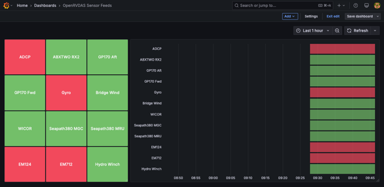

# OpenRVDAS Feed Status Dashboard



The left side shows current status of the feeds, the right show a time-series of that information.

These dashboard panels auto-adjust for whatever instruments are being fed into Influx by OpenRVDAS.  New feeds are added automatically and if a feed is inactive for more than 24 hours it is automatically removed from the list. 

## Instructions
### 1. Set up a new "openrvdas_feed_check" InfluxDB bucket with a duration of 2 days

### 2. Set up the influx task:

1. Create a new InfluxDB task called "openrvdas_feed_check"
2. Set the task to run every 30 seconds: '30s'
3. Copy the following into the task editor:
```
import "join"

allFeeds =
    from(bucket: "openrvdas")
        |> range(start: -1d)
        // Use larger range to catch all possible feeds
        |> keep(columns: ["_measurement"])
        |> distinct(column: "_measurement")
        |> map(fn: (r) => ({feed: r._measurement}))

// Step 2: Get feeds that sent data in the last 2 minutes
activeFeeds =
    from(bucket: "openrvdas")
        |> range(start: -2m)
        |> keep(columns: ["_measurement"])
        |> distinct(column: "_measurement")
        |> map(fn: (r) => ({feed: r._measurement, value: 1}))

inActiveFeeds =
    join.tables(
        left: allFeeds,
        right: activeFeeds,
        on: (l, r) => l.feed == r.feed,
        as: (l, r) => ({left_feed: l.feed, right_feed: if exists r.feed then r.feed else ""}),
        method: "left",
    )
        |> filter(fn: (r) => r.right_feed == "")
        |> map(fn: (r) => ({feed: r.left_feed, value: 0}))

union(tables: [inActiveFeeds, activeFeeds])
    |> map(
        fn: (r) => ({_time: now(), _measurement: "feed_status", _field: r.feed, _value: r.value}),
    )
    |> to(bucket: "openrvdas_feed_check")

```

### 3. Set up the Grafana Dashboard:

1. Create a new Grafana dashboard
2. Select "Import dashboard"
3. Paste the follow json object into the "Import via dashboard JSON model"
```
{
  "annotations": {
    "list": [
      {
        "builtIn": 1,
        "datasource": {
          "type": "grafana",
          "uid": "-- Grafana --"
        },
        "enable": true,
        "hide": true,
        "iconColor": "rgba(0, 211, 255, 1)",
        "name": "Annotations & Alerts",
        "type": "dashboard"
      }
    ]
  },
  "editable": true,
  "fiscalYearStartMonth": 0,
  "graphTooltip": 0,
  "id": 6,
  "links": [],
  "panels": [
    {
      "datasource": {
        "type": "influxdb",
        "uid": "eefpajwkplgjkc"
      },
      "fieldConfig": {
        "defaults": {
          "color": {
            "mode": "thresholds"
          },
          "mappings": [],
          "thresholds": {
            "mode": "absolute",
            "steps": [
              {
                "color": "red"
              },
              {
                "color": "green",
                "value": 1
              }
            ]
          }
        },
        "overrides": []
      },
      "gridPos": {
        "h": 14,
        "w": 8,
        "x": 0,
        "y": 0
      },
      "id": 1,
      "maxDataPoints": 800,
      "options": {
        "colorMode": "background_solid",
        "graphMode": "none",
        "justifyMode": "auto",
        "orientation": "auto",
        "percentChangeColorMode": "standard",
        "reduceOptions": {
          "calcs": [
            "lastNotNull"
          ],
          "fields": "",
          "values": false
        },
        "showPercentChange": false,
        "textMode": "name",
        "wideLayout": true
      },
      "pluginVersion": "11.6.0",
      "targets": [
        {
          "datasource": {
            "type": "influxdb",
            "uid": "eefpajwkplgjkc"
          },
          "query": "from(bucket: \"openrvdas_feed_check\")\n  |> range(start: -2m)\n  |> filter(fn: (r) => r[\"_measurement\"] == \"feed_status\")\n  |> aggregateWindow(every: v.windowPeriod, fn: last, createEmpty: false)\n  |> yield(name: \"last\")",
          "refId": "A"
        }
      ],
      "title": "",
      "type": "stat"
    },
    {
      "datasource": {
        "type": "influxdb",
        "uid": "eefpajwkplgjkc"
      },
      "fieldConfig": {
        "defaults": {
          "color": {
            "mode": "thresholds"
          },
          "custom": {
            "axisPlacement": "auto",
            "fillOpacity": 70,
            "hideFrom": {
              "legend": false,
              "tooltip": false,
              "viz": false
            },
            "insertNulls": false,
            "lineWidth": 0,
            "spanNulls": false
          },
          "mappings": [],
          "thresholds": {
            "mode": "absolute",
            "steps": [
              {
                "color": "red"
              },
              {
                "color": "green",
                "value": 1
              }
            ]
          }
        },
        "overrides": []
      },
      "gridPos": {
        "h": 14,
        "w": 16,
        "x": 8,
        "y": 0
      },
      "id": 2,
      "maxDataPoints": 800,
      "options": {
        "alignValue": "left",
        "legend": {
          "displayMode": "list",
          "placement": "bottom",
          "showLegend": false
        },
        "mergeValues": true,
        "rowHeight": 0.9,
        "showValue": "never",
        "tooltip": {
          "hideZeros": false,
          "mode": "single",
          "sort": "none"
        }
      },
      "pluginVersion": "11.6.0",
      "targets": [
        {
          "datasource": {
            "type": "influxdb",
            "uid": "eefpajwkplgjkc"
          },
          "query": "from(bucket: \"openrvdas_feed_check\")\n  |> range(start: v.timeRangeStart, stop: v.timeRangeStop)\n  |> filter(fn: (r) => r[\"_measurement\"] == \"feed_status\")\n  |> aggregateWindow(every: v.windowPeriod, fn: last, createEmpty: false)\n  |> yield(name: \"last\")",
          "refId": "A"
        }
      ],
      "title": "",
      "type": "state-timeline"
    }
  ],
  "preload": false,
  "refresh": "30s",
  "schemaVersion": 41,
  "tags": [],
  "templating": {
    "list": []
  },
  "time": {
    "from": "now-1h",
    "to": "now"
  },
  "timepicker": {},
  "timezone": "browser",
  "title": "OpenRVDAS Sensor Feeds",
  "uid": "bejh7zva7ij28f",
  "version": 22
}
```
4. Click the "Load" button.
5. Verify the dashboard works... you may need to wait a few minutes for the task to generated enough data to visualize.
6. Optionally, Override the names.
By default the names on the panels will use the raw variable names.  This can be overridden to make the panels easier to ready. To override the names:
  1, Click the upper-right of the panel and select "Edit". On the right-side nav bar select the "Overrides" tab.
  2. Click the "Add field override" button and select "Field with name".
  3. Select the variable name to override.
  4. Click "Add override property" and select "Standard Options > Display name".
  5. Add the string to use instead of the variable name.
  
  Repeat for each of the variables.
  Repeat the process for the other panel.
